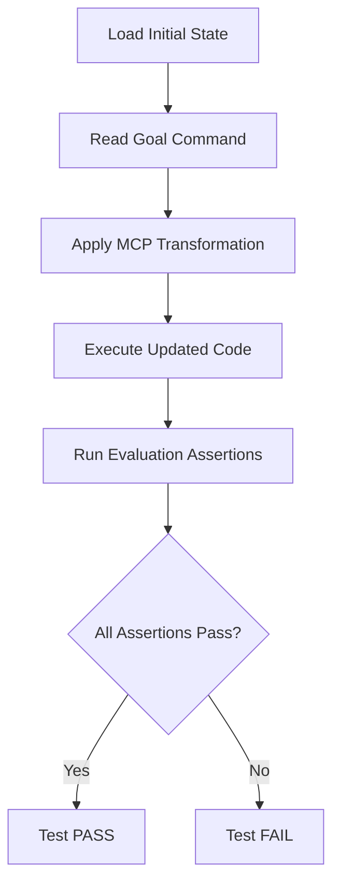

# MCP Use Cases: Integration Test Scaffolding

## Overview

The MCP use cases serve as **scaffolding for integration tests** that validate the end-to-end functionality of our Model Context Protocol (MCP) implementations across different programming languages and environments.

## Purpose

These use cases provide a structured, reproducible way to:
- Test MCP implementations across multiple programming languages
- Validate that code transformations and updates work as expected
- Ensure consistent behavior across different runtime environments
- Create a standardized testing framework for MCP functionality

## Directory Structure

Each use case follows a consistent structure:

```
use_cases/
├── ABOUT_MCP_USE_CASES.md          # This documentation
└── [use_case_name]/
    ├── SPECS.md                    # Raw requirements for the use case
    ├── initial_state.py            # Python starting code
    ├── initial_state.ts            # TypeScript starting code
    ├── initial_state.[lang]        # Additional language implementations
    ├── prompt.md                   # Exact command/transformation to send to Cursor / Windsurf / Claude Code / Codex
    └── evaluate.md                 # Assertions and expected outcomes
```

## Integration Test Workflow

### 1. **Requirements Specification**
The `SPECS.md` file contains the raw requirements and specifications from the product team that define what the use case should accomplish. This serves as the source of truth for the intended functionality and behavior.

### 2. **Initial State Setup**
Each use case defines initial code states in multiple programming languages:
- `initial_state.py` - Python implementation
- `initial_state.ts` - TypeScript implementation
- Additional language files as needed

These files represent the **starting point** before any MCP operations are applied.

### 3. **Goal Definition**
The `prompt.md` file contains:
- The specific command or transformation to trigger in Cursor / Windsurf / Claude Code / Codex

### 4. **Execution Phase**
During testing, the system will:
1. Load the appropriate initial state file for the target language
2. Apply the command/transformation specified in `prompt.md`
3. Execute the resulting updated code

### 5. **Evaluation & Assertions**
The `evaluate.md` file defines:
- Expected outcomes and behavior
- Assertions to validate the transformation worked correctly

## Test Execution Flow


