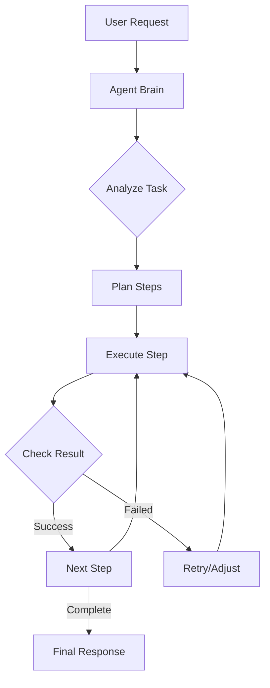

# Building an Agent

Learn how to build AI agents that can autonomously use tools, make decisions, and complete complex multi-step tasks.

## What is an AI Agent?

An AI agent is an autonomous system that can:
- Break down complex tasks into smaller steps
- Use tools and APIs to gather information
- Make decisions based on intermediate results
- Persist and retry when encountering obstacles
- Complete tasks without constant human supervision

## Architecture Overview



## Step 1: Setting Up the Agent Framework

### Basic Agent Structure

```python
from typing import List, Dict, Any, Callable
from dataclasses import dataclass
import json

@dataclass
class Tool:
    name: str
    description: str
    parameters: Dict[str, Any]
    function: Callable

class Agent:
    def __init__(self, model: str = "gpt-4", tools: List[Tool] = None):
        self.model = model
        self.tools = tools or []
        self.memory = []
        self.client = OpenAI(api_key="YOUR_API_KEY")
    
    def add_tool(self, tool: Tool):
        self.tools.append(tool)
    
    def think(self, task: str) -> str:
        """Agent's reasoning process"""
        system_prompt = f"""You are an AI agent that can use tools to complete tasks.
        
        Available tools:
        {self._format_tools()}
        
        Break down the task into steps and use tools when needed.
        Always explain your reasoning."""
        
        response = self.client.chat.completions.create(
            model=self.model,
            messages=[
                {"role": "system", "content": system_prompt},
                {"role": "user", "content": task}
            ]
        )
        
        return response.choices[0].message.content
```

## Step 2: Implementing Tools

### Creating Tools for Your Agent

```python
# Example: Web Search Tool
def web_search(query: str) -> str:
    """Search the web for information"""
    # Implementation using a search API
    import requests
    response = requests.get(
        "https://api.search.com/search",
        params={"q": query},
        headers={"Authorization": "Bearer YOUR_SEARCH_API_KEY"}
    )
    return json.dumps(response.json()["results"][:3])

# Example: Calculator Tool
def calculator(expression: str) -> str:
    """Evaluate mathematical expressions"""
    try:
        result = eval(expression, {"__builtins__": {}}, {})
        return f"Result: {result}"
    except Exception as e:
        return f"Error: {str(e)}"

# Example: File Operations Tool
def read_file(filename: str) -> str:
    """Read contents of a file"""
    try:
        with open(filename, 'r') as f:
            return f.read()
    except Exception as e:
        return f"Error reading file: {str(e)}"

# Register tools with the agent
agent = Agent()
agent.add_tool(Tool(
    name="web_search",
    description="Search the web for current information",
    parameters={"query": "string"},
    function=web_search
))
agent.add_tool(Tool(
    name="calculator",
    description="Perform mathematical calculations",
    parameters={"expression": "string"},
    function=calculator
))
```

## Step 3: Implementing Tool Calling

### Function Calling with OpenAI

```python
class AdvancedAgent(Agent):
    def execute_with_tools(self, task: str) -> str:
        messages = [
            {"role": "system", "content": "You are an AI agent that uses tools to complete tasks."},
            {"role": "user", "content": task}
        ]
        
        # Convert tools to OpenAI function format
        functions = []
        for tool in self.tools:
            functions.append({
                "name": tool.name,
                "description": tool.description,
                "parameters": {
                    "type": "object",
                    "properties": tool.parameters,
                    "required": list(tool.parameters.keys())
                }
            })
        
        while True:
            # Get AI response
            response = self.client.chat.completions.create(
                model=self.model,
                messages=messages,
                functions=functions,
                function_call="auto"
            )
            
            message = response.choices[0].message
            messages.append(message)
            
            # Check if AI wants to call a function
            if message.function_call:
                function_name = message.function_call.name
                function_args = json.loads(message.function_call.arguments)
                
                # Execute the function
                tool = next((t for t in self.tools if t.name == function_name), None)
                if tool:
                    result = tool.function(**function_args)
                    
                    # Add function result to conversation
                    messages.append({
                        "role": "function",
                        "name": function_name,
                        "content": result
                    })
                else:
                    messages.append({
                        "role": "function",
                        "name": function_name,
                        "content": "Error: Function not found"
                    })
            else:
                # AI provided final answer
                return message.content
```

## Step 4: Building a ReAct Agent

### Reasoning and Acting Pattern

```python
class ReActAgent(AdvancedAgent):
    def react_loop(self, task: str, max_steps: int = 10) -> str:
        """
        Implements the ReAct (Reasoning and Acting) pattern
        """
        react_prompt = """You are an AI agent using the ReAct framework.
        
        For each step:
        1. Thought: Analyze what you need to do
        2. Action: Choose and execute a tool
        3. Observation: Process the result
        4. Repeat until task is complete
        
        Format your response as:
        Thought: [your reasoning]
        Action: [tool_name]
        Action Input: [tool parameters]
        
        When done, respond with:
        Thought: I have completed the task
        Final Answer: [your final response]
        """
        
        messages = [
            {"role": "system", "content": react_prompt},
            {"role": "user", "content": f"Task: {task}"}
        ]
        
        for step in range(max_steps):
            response = self.client.chat.completions.create(
                model=self.model,
                messages=messages
            )
            
            content = response.choices[0].message.content
            messages.append({"role": "assistant", "content": content})
            
            # Parse the response
            if "Final Answer:" in content:
                return content.split("Final Answer:")[-1].strip()
            
            if "Action:" in content and "Action Input:" in content:
                # Extract action and input
                action = content.split("Action:")[1].split("Action Input:")[0].strip()
                action_input = content.split("Action Input:")[1].strip()
                
                # Execute the tool
                tool = next((t for t in self.tools if t.name == action), None)
                if tool:
                    try:
                        result = tool.function(action_input)
                        observation = f"Observation: {result}"
                    except Exception as e:
                        observation = f"Observation: Error - {str(e)}"
                else:
                    observation = f"Observation: Tool '{action}' not found"
                
                messages.append({"role": "user", "content": observation})
        
        return "Maximum steps reached. Task may be incomplete."
```

## Step 5: Memory and Context Management

### Implementing Long-term Memory

```python
class MemoryAgent(ReActAgent):
    def __init__(self, *args, **kwargs):
        super().__init__(*args, **kwargs)
        self.short_term_memory = []
        self.long_term_memory = {}
        self.working_memory = {}
    
    def remember(self, key: str, value: Any):
        """Store information in long-term memory"""
        self.long_term_memory[key] = value
    
    def recall(self, key: str) -> Any:
        """Retrieve information from memory"""
        return self.long_term_memory.get(key)
    
    def update_working_memory(self, task_context: Dict[str, Any]):
        """Update working memory for current task"""
        self.working_memory = task_context
    
    def get_context_prompt(self) -> str:
        """Build context from memory"""
        context = "Current context:\n"
        
        # Add working memory
        if self.working_memory:
            context += f"Working Memory: {json.dumps(self.working_memory)}\n"
        
        # Add relevant long-term memories
        if self.long_term_memory:
            context += f"Relevant Knowledge: {json.dumps(list(self.long_term_memory.keys()))}\n"
        
        return context
```

## Step 6: Advanced Agent Patterns

### Multi-Agent Collaboration

```python
class TeamAgent:
    def __init__(self):
        self.agents = {}
    
    def add_agent(self, name: str, agent: Agent, role: str):
        self.agents[name] = {
            "agent": agent,
            "role": role
        }
    
    def collaborate(self, task: str) -> str:
        """Coordinate multiple agents to complete a task"""
        # Planning agent decides task distribution
        planner = self.agents.get("planner")
        if not planner:
            return "No planner agent available"
        
        plan = planner["agent"].think(
            f"Break down this task for the team: {task}\n" +
            f"Available agents: {[f'{name} ({info['role']})' for name, info in self.agents.items()]}"
        )
        
        # Execute plan with different agents
        results = {}
        for agent_name, subtask in self.parse_plan(plan).items():
            if agent_name in self.agents:
                agent = self.agents[agent_name]["agent"]
                results[agent_name] = agent.execute_with_tools(subtask)
        
        # Synthesizer agent combines results
        synthesizer = self.agents.get("synthesizer")
        if synthesizer:
            return synthesizer["agent"].think(
                f"Combine these results into a final answer: {json.dumps(results)}"
            )
        
        return json.dumps(results)
```

### Self-Improving Agent

```python
class LearningAgent(MemoryAgent):
    def __init__(self, *args, **kwargs):
        super().__init__(*args, **kwargs)
        self.performance_history = []
    
    def execute_and_learn(self, task: str) -> str:
        """Execute task and learn from the experience"""
        # Execute task
        result = self.execute_with_tools(task)
        
        # Self-evaluate
        evaluation = self.self_evaluate(task, result)
        
        # Store experience
        experience = {
            "task": task,
            "result": result,
            "evaluation": evaluation,
            "timestamp": datetime.now().isoformat()
        }
        self.performance_history.append(experience)
        
        # Learn from mistakes
        if evaluation["score"] < 0.7:
            self.analyze_failure(experience)
        
        return result
    
    def self_evaluate(self, task: str, result: str) -> Dict[str, Any]:
        """Evaluate own performance"""
        evaluation_prompt = f"""
        Evaluate the following task completion:
        Task: {task}
        Result: {result}
        
        Provide a score (0-1) and explanation.
        """
        
        response = self.client.chat.completions.create(
            model=self.model,
            messages=[
                {"role": "system", "content": "You are evaluating an AI agent's performance."},
                {"role": "user", "content": evaluation_prompt}
            ],
            response_format={
                "type": "json_schema",
                "json_schema": {
                    "type": "object",
                    "properties": {
                        "score": {"type": "number"},
                        "explanation": {"type": "string"}
                    }
                }
            }
        )
        
        return json.loads(response.choices[0].message.content)
```

## Deployment and Production

### Agent Server

```python
from fastapi import FastAPI, HTTPException
from pydantic import BaseModel

app = FastAPI()

# Initialize your agent
agent = MemoryAgent(
    model="gpt-4",
    tools=[
        # Add your tools here
    ]
)

class TaskRequest(BaseModel):
    task: str
    context: Dict[str, Any] = {}

class TaskResponse(BaseModel):
    result: str
    steps_taken: int
    tools_used: List[str]

@app.post("/execute", response_model=TaskResponse)
async def execute_task(request: TaskRequest):
    try:
        # Update context
        agent.update_working_memory(request.context)
        
        # Execute task
        result = agent.react_loop(request.task)
        
        return TaskResponse(
            result=result,
            steps_taken=len(agent.memory),
            tools_used=[step.get("tool") for step in agent.memory if "tool" in step]
        )
    except Exception as e:
        raise HTTPException(status_code=500, detail=str(e))

@app.get("/memory/{key}")
async def get_memory(key: str):
    value = agent.recall(key)
    if value is None:
        raise HTTPException(status_code=404, detail="Memory key not found")
    return {"key": key, "value": value}
```

## Best Practices

1. **Tool Design**: Keep tools focused and single-purpose
2. **Error Handling**: Implement robust error handling in tools
3. **Context Limits**: Monitor token usage and trim context when needed
4. **Safety**: Implement safeguards to prevent harmful actions
5. **Monitoring**: Log all agent actions for debugging and improvement
6. **Testing**: Test agents with diverse scenarios and edge cases

## Common Patterns

### Task Decomposition
```python
def decompose_task(task: str) -> List[str]:
    """Break complex tasks into subtasks"""
    response = client.chat.completions.create(
        model="gpt-4",
        messages=[
            {"role": "system", "content": "Break down tasks into clear, actionable steps."},
            {"role": "user", "content": f"Break down: {task}"}
        ]
    )
    # Parse response into list of subtasks
    return parse_subtasks(response.choices[0].message.content)
```

### Error Recovery
```python
def with_retry(func, max_attempts=3):
    """Decorator for automatic retry on failure"""
    def wrapper(*args, **kwargs):
        for attempt in range(max_attempts):
            try:
                return func(*args, **kwargs)
            except Exception as e:
                if attempt == max_attempts - 1:
                    raise
                time.sleep(2 ** attempt)
        return None
    return wrapper
```

## Next Steps

- Implement specialized tools for your use case
- Add [observability](/docs/observability) for agent monitoring
- Explore [evaluations](/docs/evaluations) to measure agent performance
- Consider [fine-tuning](/docs/deployments) models for specific agent behaviors 